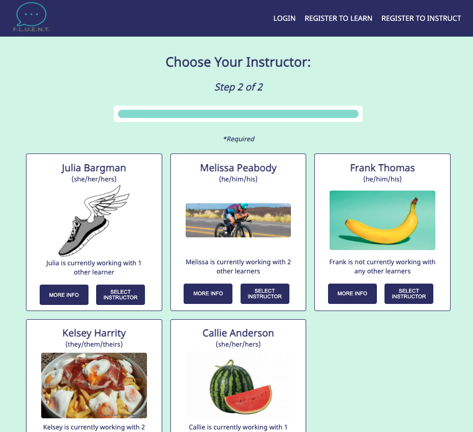
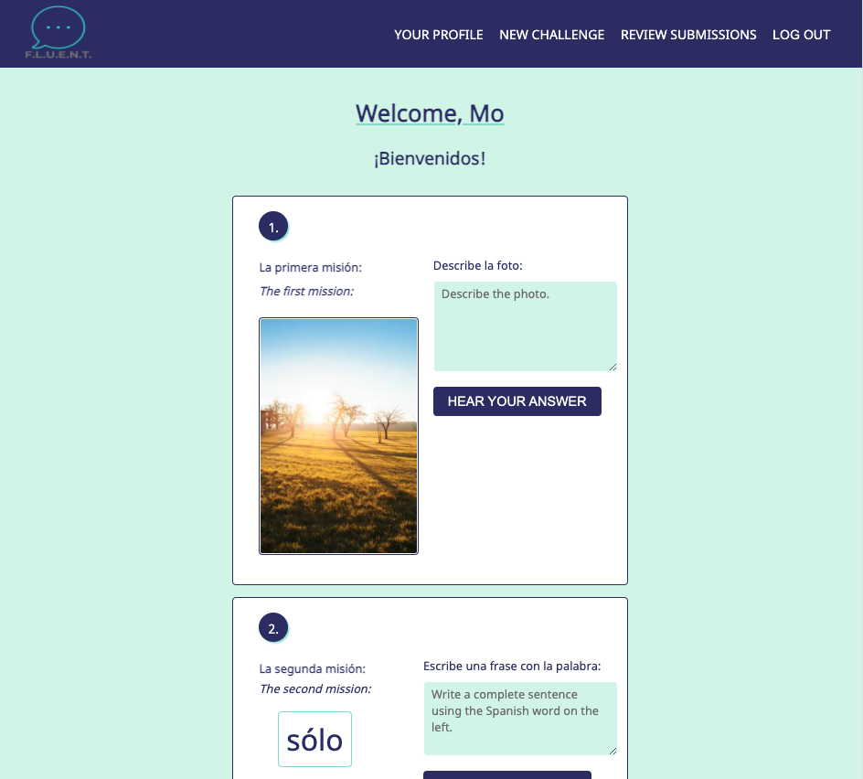
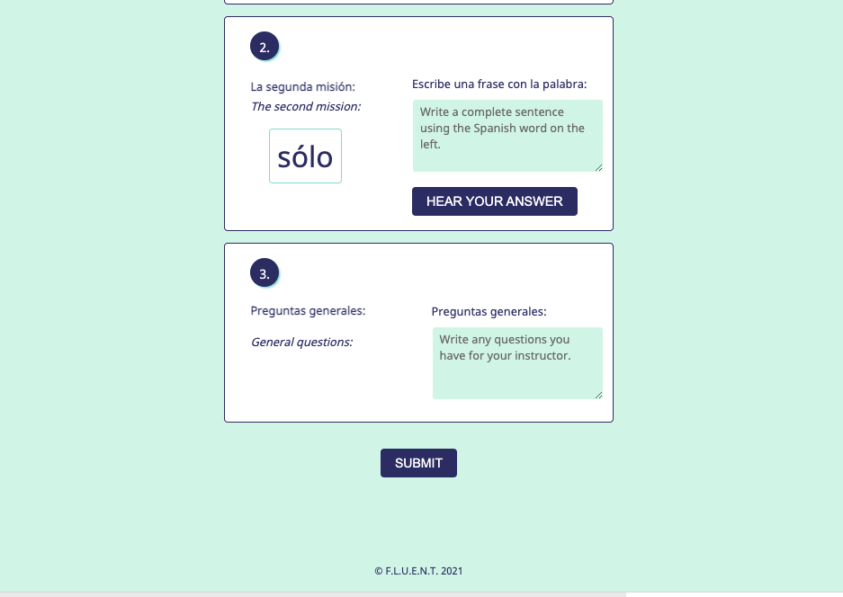
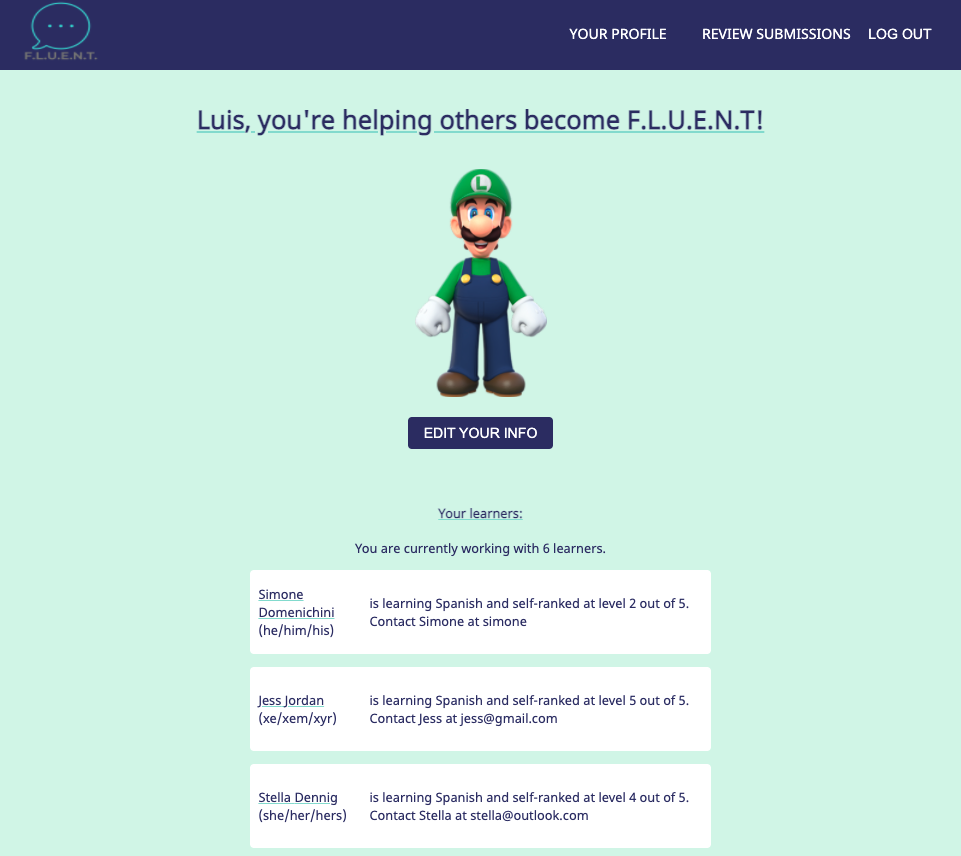
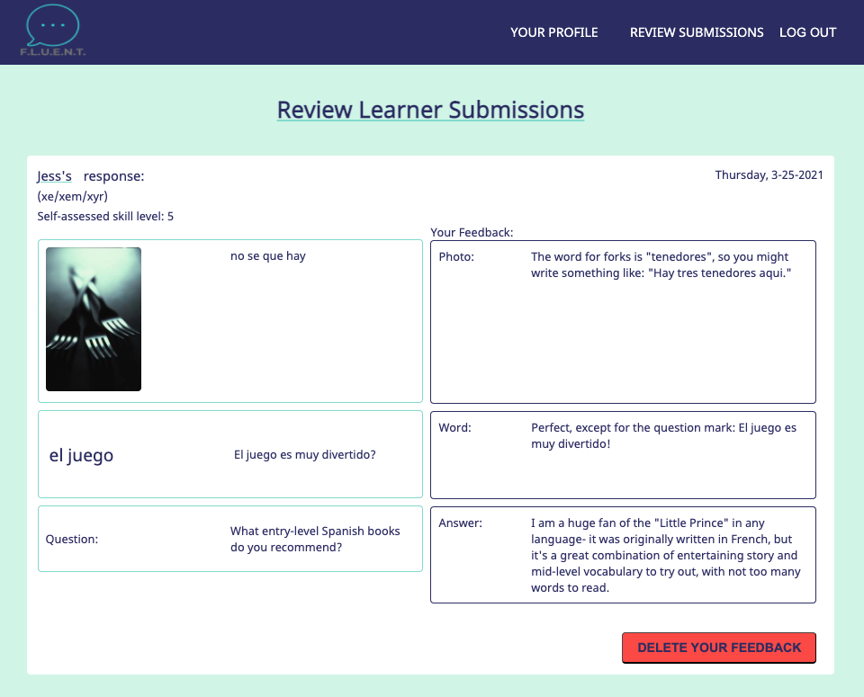

# F.L.U.E.N.T. application

This application is a solution to the loneliness and lack of context experienced during self-directed foreign language study.  


Users may register as either Learners or Instructors.  


Learners choose from available instructors to pair with someone who will receive their submissions the language challenges and give them feedback.  




Learners can hear their written answers spoken aloud in a native accent of the language they are learning!    






Learners receive positive reinforcement by earning coins and keeping their activity streak going, and have tailored greeetings to help them feel more personally connected to the foreign language.


Instructors set a limit of how many Learners they would like to be paired with, and when their limit is reached, they will no longer appear as an available instructor in that language.  



Instructors share tailored feedback to their paired Learners' submissions, providing context and interaction to what was a lonely experience.




## Built with:

React, Redux, Express, Node, Passport, PostgreSQL, HTML, CSS, JS, Lorem Picsum API, and the JS Web Speech API.


## Prerequisites

Before you get started, make sure you have the following software installed on your computer:

- [Node.js](https://nodejs.org/en/)
- [PostrgeSQL](https://www.postgresql.org/)
- [Nodemon](https://nodemon.io/)


## Create database and table

Create a new database called `fluent_db` and run all of the SQL queries found in the database.sql.


## Development Setup Instructions

- Run `npm install`
- Create a `.env` file at the root of the project and paste this line into the file:
  ```
  SERVER_SESSION_SECRET=superDuperSecret
  ```
  While you're in your new `.env` file, take the time to replace `superDuperSecret` with some long random string like `25POUbVtx6RKVNWszd9ERB9Bb6` to keep your application secure. Here's a site that can help you: [https://passwordsgenerator.net/](https://passwordsgenerator.net/). If you don't do this step, create a secret with less than eight characters, or leave it as `superDuperSecret`, you will get a warning.
- Start postgres if not running already by using `brew services start postgresql`
- Run `npm run server`
- Run `npm run client`
- Navigate to `localhost:3000`


## Production Build

- Start postgres if not running already by using `brew services start postgresql`
- Run `npm start`
- Navigate to `localhost:5000`


## Lay of the Land

Directory Structure:

- `src/` contains the React application
- `public/` contains static assets for the client-side
- `build/` after you build the project, contains the transpiled code from `src/` and `public/` that will be viewed on the production site
- `server/` contains the Express App


## Acknowledgement

Thanks to [Prime Digital Academy](https://www.primeacademy.io/) who equipped and helped me to make this application a reality.
